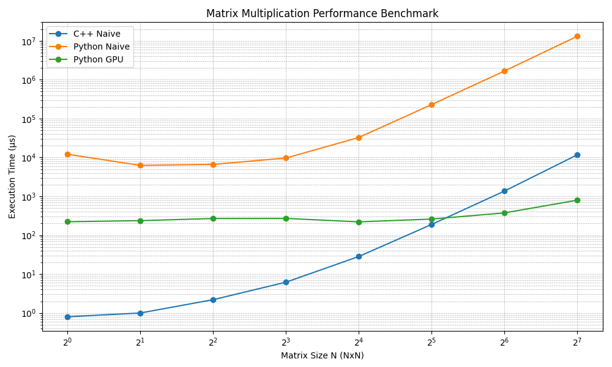

# High-Performance Matrix Multiplication

This project explores the performance differences between **naïve implementations** of matrix multiplication in Python and C++, as well as a **GPU-accelerated implementation** in Python using PyTorch.  

The goal is to understand how runtime performance scales with matrix size across:
- Pure Python (triple nested loops)
- C++ (compiled, triple nested loops)
- Python with GPU acceleration (PyTorch `torch.matmul`)

---

## Motivation
Matrix multiplication is a core operation in scientific computing, graphics, and machine learning.  
By comparing performance across languages and hardware backends, we can highlight:
- The overhead cost of Python’s interpreter.
- The efficiency of compiled C++ for small workloads.
- The benefits (and startup overhead) of GPU acceleration.

---

## Project Structure
```text
├── README.md                       # What you're reading right now!
├── requirements.txt                # Python dependencies
├── data
│   ├── MatA.txt                    # Generated by "generate_matrices.py"
│   ├── MatB.txt                    # ...
│   └── benchmark_results.csv       # Generated by "run_benchmark.py"
├── public
│   └── mmul_performance_plot.png   # Generated by "plot_benchmark.py"
├── src
│   ├── Makefile
│   ├── main.cpp                    # Naive C++ implementation
│   └── main.py                     # Naive + GPU-accelerated implementation
└── test
    ├── generate_matrices.py        # Generates N by N matrices for benchmarking
    ├── plot_benchmark.py           # Creates performance plots for CSV results
    └── run_benchmark.py            # Automates benchmarking and outputs a CSV
```

---

## How to Run

0. **Requirements**
- Python 3.9+
- g++ (C++20 compatible)

To install the Python dependencies, run:

```bash
pip install -r requirements.txt
```

1. **Compile C++ code:**
```bash
   g++ -std=c++20 main.cpp -o main
```

Alternatively, there is a Makefile, which you can run with:

```bash
    make
```

2. **Run for a specific size (example: 128x128):**

python3 setup.py 128      # generate matrices
./main                    # run C++ naive
python3 main.py           # run Python naive + GPU

3. **Run full benchmark across multiple sizes:**

python3 test-script.py

---

### Plot



### Analysis

- **C++ Naive vs. Python Naive**  
  C++ significantly outperforms Python in the naive (CPU) approach. This is expected because C++ compiles down to optimized machine code, while Python incurs heavy interpreter overhead in nested loops. For small matrices (e.g., `N=1` or `N=2`), the C++ implementation runs in under a microsecond, while Python takes several thousand microseconds.

- **GPU Acceleration (PyTorch)**  
  The GPU implementation is *orders of magnitude faster* for larger matrices. For example:
  - At `N=128`, Python Naive takes ~13 million µs,  
  - while Python GPU takes only ~796 µs.  

  This demonstrates the advantage of leveraging highly optimized, parallelized GPU libraries like CUDA under PyTorch.

- **Overhead for Small Matrices**  
  Interestingly, the GPU implementation isn’t always the fastest for very small matrices. For `N=1–8`, GPU timings are comparable or slightly slower than the C++ naive implementation. This overhead comes from setting up GPU kernels, which only pays off once the matrix size is large enough to exploit parallelism.

- **Takeaway**  
  - Use C++ or optimized libraries for small-to-medium sizes.  
  - Use GPU acceleration for large matrix sizes.  
  - Python naive approaches are impractical for performance-critical tasks.

## TL;DR
- Python Naïve: Extremely slow, even for small N, due to interpreter overhead.
- C++ Naïve: Fast for small sizes; runtime grows cubically.
- Python GPU: Higher startup overhead, but scales better at larger sizes.
